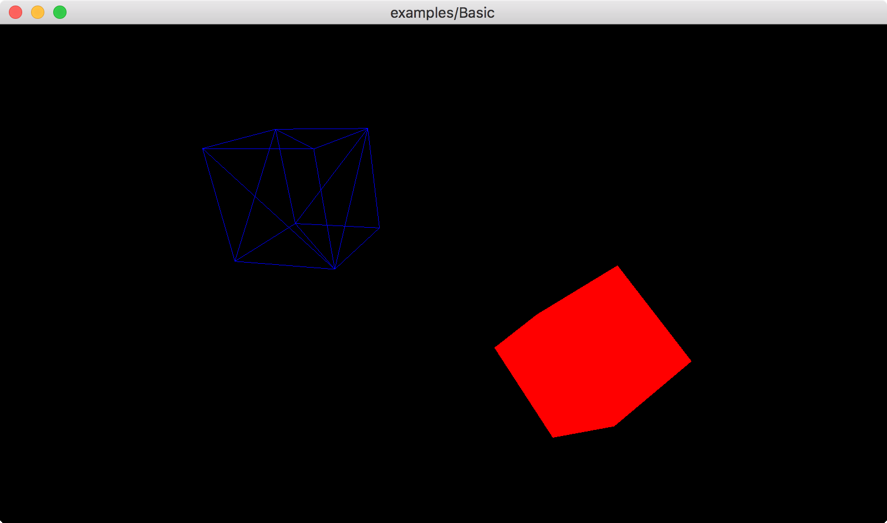

## threecpp

Another C++ version of [three.js](https://threejs.org/)


### Example
```c++
#include "three.h"
using namespace three;

class BasicWindowApp: public WindowApp {
private:
  Scene scene;
  PerspectiveCamera camera { 60, width_ * 1.0 / height_, 1, 10000 };
  BoxGeometry geometry { 200, 200, 200 };
  MeshBasicMaterial material1, material2;
  Mesh mesh1 { &geometry, &material1 }, mesh2 { &geometry, &material2 };
  OpenGLRenderer renderer;

public:
  BasicWindowApp() :
      WindowApp(800, 450, "examples/Basic") {
  }

  void initScene() override {
    renderer.setPixelRatio(getPixelRatio()).setSize(width_, height_);

    camera.position.z = 800;

    material1.color(Color(0x0000ff)).wireframe(true);
    material2.color(Color(0xff0000)).wireframe(false);

    mesh1.position.x -= 300;
    mesh2.position.x += 300;

    scene.add(&mesh1);
    scene.add(&mesh2);
  }

  void animate() override {
    mesh1.rotation.x += 0.5;
    mesh1.rotation.y += 1.0;

    mesh2.rotation.x += 1.0;
    mesh2.rotation.y += 0.5;

    renderer.render(&scene, &camera);
  }
};

int main(void) {
  return BasicWindowApp().init().run();
}
```
<kbd></kbd>

### Current Status
For demo purpose

### TODOs
* Feb, 2017: Cameras, Keyboard Event, Lighting
* Mar, 2017: Materials

### Contact
xizhonghua AT gmail
